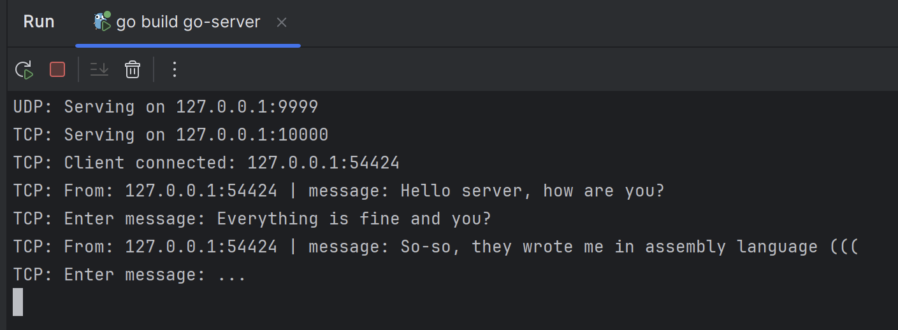
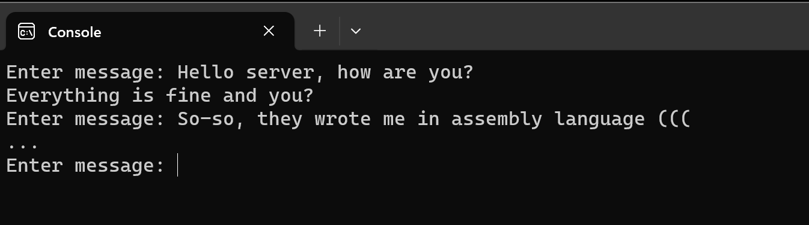

# TCP & UDP golang server + assambly client
This project has an examples for golang TCP and UDP server and assambly TCP and UDP client for windows.
In essence, this is a regular chat server, just with a possibly useful client implementation in assembler.

### Demonstration of work:
**Server**:


**Client**:


## Server
In the config you can change the "protocol" option to "udp" or "tcp" to switch protocol.
You can also use other parameters in this config.

## Client
The client implementation uses WinAPI to work with sockets, accordingly this example only works with Windows.
The entire implementation is located in the /socket/ folder. You can easily connect this code, an example for this is in the "Main.asm" file. Examples of chat clients for TCP and UDP have also been implemented.

To implement the client, some abstractions were written over the standard WinAPI functions:
## Client (/socket/) functions:
## -- General functionality --
### Init socket library:
```asm
    stdcall ws_soket_init
```
**Arguments**: 
- none

**Return**: 
- error code in eax, if eax == 0, then initialization was successful

### Close socket library: 
```asm
    stdcall ws_close_connection
```
**Arguments**: 
- none

**Return**: 
- none

### Create new socket:
```asm
    stdcall ws_new_socket, socket_type
```
**Arguments**: 
- socket_type - WS_UDP or WS_TCP

**Return**: 
- socket descriptor in eax. Successful if eax not zero.

### Create new socket data structure (used for further work with the socket):
```asm
    stdcall ws_new_connection_structure, ip, port
```
**Arguments**: 
- ip - server ip, port - server port

**Return**: 
- adress of socket data structure (winapi sock_addr)

## -- TCP functionality --
### Connect to tcp server: 
```asm
    stdcall ws_tcp_connect, socket_handle, server_addr
```
**Arguments**: 
- socket_handle - socket descriptor (use ws_new_socket to get this descriptor)
- server_addr - socket data structure adress (use ws_new_connection_structure to get this structure)

**Return**:
- error code in eax, successful if eax == 0

### Send message:
```asm
    stdcall ws_socket_send_msg_tcp, socket, msg, msg_len
```
**Arguments**:
- socket - socket descriptor
- msg - adress to message buffer
- msg_len - length of this message

**Return**:
- number of bytes sent in eax, if eax < 0, then an error has occurred
### Get message:
```asm
    stdcall ws_socket_get_msg_tcp, socket, buf, buf_len
```
**Arguments**:
- socket - socket descriptor
- buf - buffer to save message
- buf_len - length of this buffer

**Return**:
- number of bytes sent in eax, if eax < 0, then an error has occurred

## -- UDP functionality --
### Send message:
```asm
    stdcall ws_socket_send_msg_udp, socket, soket_info, msg, msg_len
```
**Arguments**:
- socket - socket descriptor
- soket_info - socket data structure adress
- msg - adress to message buffer
- msg_len - length of this message

**Return**:
- number of bytes sent in eax, if eax < 0, then an error has occurred

### Get message:
```asm
    stdcall ws_socket_get_msg_udp, socket, buf, buf_len
```
**Arguments**:
- socket - socket descriptor
- buf - buffer to save message
- buf_len - length of this buffer

**Return**:
- number of bytes sent in eax, if eax < 0, then an error has occurred 